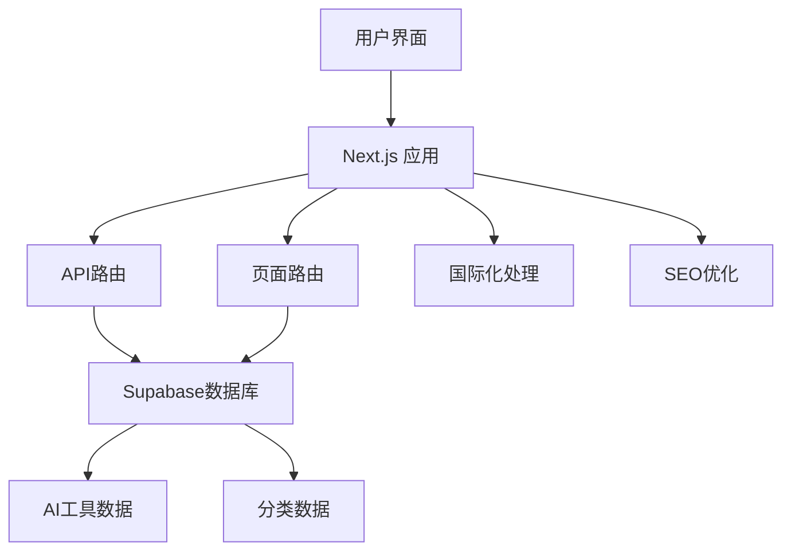
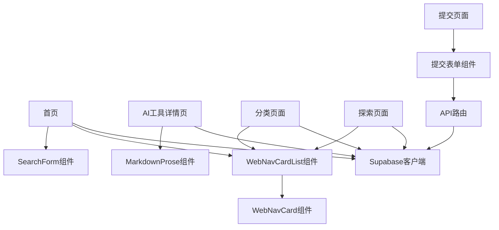

# ShipFaster 开发者指南

## 项目概述

**项目名称**：ShipFaster

**简要描述**：这是一个开源的AI工具导航网站项目，旨在帮助用户创建自己的AI工具目录，收集和展示自己喜欢的AI工具产品。项目轻量级且易于维护，适合对AI导航网站感兴趣的个人开发者以及学习Next.js的学习者。

**编程语言和框架**：
- TypeScript/JavaScript
- Next.js 14 (App Router)
- React (Server Components)
- Supabase (PostgreSQL)
- Tailwind CSS

## 开发环境设置

### 系统要求
- Node.js >= 20.0.0
- PNPM >= 8.0.0

### 安装步骤

1. 克隆项目仓库
```bash
git clone https://github.com/6677-ai/shipfaster-webui.git
```

2. 进入项目目录
```bash
cd shipfaster-webui
```

3. 使用正确的Node.js版本
```bash
nvm use
```

4. 安装依赖
```bash
pnpm i
```

5. 创建并配置环境文件
   - 复制`.env.example`文件并重命名为`.env.local`
   - 填写所需的环境变量值

6. 启动开发服务器
```bash
pnpm dev
```

## 整体架构概览

ShipFaster项目采用现代化的前端架构，基于Next.js 14的App Router模式构建，使用React Server Components提高性能和SEO友好性。项目的数据存储使用Supabase作为无服务器数据库，支持国际化和SEO优化。

### 主要组件及其交互方式



### 项目目录结构

```
项目根目录
├── app/                   # Next.js页面和API路由
│   ├── api/               # API端点
│   │   ├── cron/          # 定时任务API
│   │   ├── cron_callback/ # 定时任务回调API
│   │   └── submit/        # 工具提交API
│   ├── [locale]/          # 国际化路由
│   │   └── (with-footer)/ # 带页脚的布局路由组
│   │       ├── (home)/    # 首页路由
│   │       ├── ai/        # AI工具详情页路由
│   │       ├── category/  # 分类页面路由
│   │       └── explore/   # 探索页面路由
├── components/            # 可复用组件
│   ├── ad/                # 广告相关组件
│   ├── explore/           # 探索页面组件
│   ├── home/              # 首页组件
│   ├── image/             # 图片相关组件
│   ├── page/              # 页面级组件
│   ├── seo/               # SEO相关组件
│   ├── ui/                # UI基础组件
│   └── webNav/            # AI工具导航组件
├── db/                    # 数据库相关
│   └── supabase/          # Supabase数据库
│       ├── client.ts      # 数据库客户端
│       ├── create_table.sql # 表创建SQL
│       ├── types.d.ts     # 数据库类型定义
│       ├── insert_category_data.sql # 分类数据
│       └── insert_data.sql # 示例数据
├── lib/                   # 工具库
│   ├── utils/             # 工具函数
│   ├── constants.ts       # 常量定义
│   ├── data.ts            # 数据处理
│   ├── env.ts             # 环境变量
│   └── utils.ts           # 通用工具
├── messages/              # i18n消息
├── middlewares/           # 中间件
├── public/                # 静态资源
└── 其他配置文件...
```

## 代码文件依赖关系

项目的核心依赖关系如下：

1. **页面组件依赖关系**
```
app/[locale]/(with-footer)/(home)/page.tsx
├── components/home/SearchForm.tsx
├── components/webNav/WebNavCardList.tsx
│   └── components/webNav/WebNavCard.tsx
├── components/Faq.tsx
└── db/supabase/client.ts
```

2. **AI工具详情页依赖关系**
```
app/[locale]/(with-footer)/ai/[websiteName]/page.tsx
├── db/supabase/client.ts
├── components/image/BaseImage.tsx
└── components/MarkdownProse.tsx
```

3. **数据库依赖关系**
```
db/supabase/client.ts
└── db/supabase/types.ts
```

4. **API路由依赖关系**
```
app/api/cron/route.ts (定时任务)
app/api/submit/route.ts (提交新AI工具)
└── db/supabase/client.ts
```

## 功能模块调用逻辑

### 1. 首页加载及AI工具展示

当用户访问首页时，调用流程如下：

1. `app/[locale]/(with-footer)/(home)/page.tsx`文件中的`Page`函数被调用
2. 创建Supabase客户端连接(`createClient()`)
3. 并行获取分类列表和最新AI工具列表
   ```typescript
   const [{ data: categoryList }, { data: navigationList }] = await Promise.all([
     supabase.from('navigation_category').select(),
     supabase.from('web_navigation').select().order('collection_time', { ascending: false }).limit(12),
   ]);
   ```
4. 渲染分类标签列表(`TagList`组件)
5. 渲染AI工具卡片列表(`WebNavCardList`组件)
   - 每个工具通过`WebNavCard`组件显示

### 2. AI工具搜索

当用户执行搜索操作时，调用流程如下：

1. 用户在`SearchForm`组件中输入关键词并提交表单
2. 表单提交处理函数`onSubmit`被触发
3. 使用Next.js的`router.push`导航到搜索结果页面
   ```typescript
   const onSubmit = (data: z.infer<typeof FormSchema>) => {
     if (!data.search.trim()) return;
     router.push(`/query/${data.search}`);
   };
   ```
4. 搜索结果页面(`app/[locale]/(with-footer)/(home)/query/[keyword]/page.tsx`)加载
5. 使用Supabase全文搜索查询匹配的AI工具
6. 渲染搜索结果列表

### 3. AI工具详情页查看

当用户点击AI工具卡片查看详情时，调用流程如下：

1. 导航到`/ai/[websiteName]`路由
2. `app/[locale]/(with-footer)/ai/[websiteName]/page.tsx`中的`Page`函数被调用
3. 从URL参数中获取`websiteName`
4. 创建Supabase客户端并查询特定AI工具的信息
   ```typescript
   const { data: dataList } = await supabase.from('web_navigation').select().eq('name', websiteName);
   ```
5. 如果找不到数据，使用`notFound()`跳转到404页面
6. 渲染AI工具详情，包括标题、描述、图片和Markdown格式的详细内容
7. 提供访问原始网站的链接

### 4. 提交新AI工具

用户提交新AI工具的流程：

1. 用户访问提交页面并填写表单
2. 提交表单触发POST请求到`/api/submit`
3. API处理请求并将数据保存到`submit`表
4. 定时任务API(`/api/cron`)定期检查未处理的提交
5. 处理和验证提交的数据
6. 将验证通过的数据添加到`web_navigation`表

## 关键代码文件位置索引

| 文件路径 | 详细说明 |
|---------|---------|
| `app/[locale]/(with-footer)/(home)/page.tsx` | 首页入口文件，负责渲染首页内容，包括搜索框、分类标签和AI工具列表 |
| `app/[locale]/(with-footer)/ai/[websiteName]/page.tsx` | AI工具详情页，展示特定AI工具的详细信息和描述 |
| `app/[locale]/(with-footer)/category/[categoryName]/page.tsx` | 分类页面，展示特定分类下的所有AI工具 |
| `app/[locale]/(with-footer)/explore/page.tsx` | 探索页面，展示更多AI工具，支持分页查询 |
| `app/api/cron/route.ts` | 定时任务API，负责定期从爬虫获取新的AI工具数据 |
| `app/api/submit/route.ts` | 提交API，处理用户提交的新AI工具 |
| `db/supabase/client.ts` | Supabase客户端创建函数，用于连接数据库 |
| `db/supabase/types.d.ts` | 数据库类型定义文件，定义了表结构和字段类型 |
| `components/webNav/WebNavCardList.tsx` | AI工具卡片列表组件，用于展示多个AI工具卡片 |
| `components/webNav/WebNavCard.tsx` | AI工具卡片组件，用于展示单个AI工具的基本信息 |
| `components/home/SearchForm.tsx` | 搜索表单组件，处理用户搜索输入和提交 |
| `lib/constants.ts` | 常量定义文件，包含各种配置和固定值 |
| `middleware.ts` | Next.js中间件，处理国际化路由和重定向 |

## 数据库结构

项目使用Supabase作为后端数据库，主要表结构如下：

### web_navigation (AI工具表)

存储所有AI工具的信息。

```sql
CREATE TABLE IF NOT EXISTS public.web_navigation (
  id bigint GENERATED BY DEFAULT AS IDENTITY,
  name TEXT PRIMARY KEY,
  title TEXT,
  content TEXT,
  detail TEXT,
  url TEXT,
  image_url TEXT,
  thumbnail_url TEXT,
  website_data TEXT,
  collection_time TIMESTAMPTZ,
  star_rating INTEGER,
  tag_name TEXT,
  category_name TEXT
) TABLESPACE pg_default;
```

### navigation_category (分类表)

存储AI工具的分类信息。

```sql
CREATE TABLE IF NOT EXISTS public.navigation_category (
  id bigint primary key generated always as identity,
  name text not null,
  title text,
  sort integer,
  del_flag integer default 0,
  create_by bigint default 0,
  create_time timestamp with time zone not null default now()
) TABLESPACE pg_default;
```

### submit (提交表)

存储用户提交的新AI工具信息。

```sql
CREATE TABLE IF NOT EXISTS public.submit (
  id bigint GENERATED BY DEFAULT AS IDENTITY,
  created_at timestamp with time zone NOT NULL DEFAULT now(),
  name text NULL,
  url text NULL,
  email text NULL,
  is_feature integer default 0,
  status integer default 0,
  CONSTRAINT submit_pkey PRIMARY KEY (id)
) TABLESPACE pg_default;
```

## 依赖关系图表

以下是核心模块之间的依赖关系示意图：



## 国际化处理

项目使用`next-intl`库实现国际化支持：

1. 语言配置在`i18n.ts`文件中定义
2. 翻译文本存储在`messages`目录下
3. 语言切换通过`LocaleSwitcher.tsx`组件实现
4. URL路径中的`[locale]`参数用于识别当前语言
5. `middleware.ts`负责处理语言重定向和默认语言设置

## 命名约定和设计模式

项目遵循以下命名约定和设计模式：

1. **命名约定**：
   - 组件使用Pascal命名法（如`WebNavCard`）
   - 函数和变量使用camelCase命名法（如`createClient`）
   - 常量使用大写蛇形命名法（如`REVALIDATE_ONE_HOUR`）
   - 数据库表使用下划线命名法（如`web_navigation`）

2. **设计模式**：
   - 使用Next.js的App Router和路由组
   - 采用React Server Components提高性能
   - 使用客户端组件处理交互逻辑
   - 使用Supabase作为数据存储和查询服务
   - 采用分层架构，UI组件、数据访问、业务逻辑清晰分离

3. **代码组织**：
   - 可重用UI组件统一放置在`components`目录
   - 页面路由按照功能分组，使用Next.js的路由组隔离布局
   - 使用`lib`目录存放工具函数和常量
   - 数据库相关代码统一放置在`db`目录

## 开发指南

### 添加新功能

1. **添加新页面**
   - 在`app/[locale]/(with-footer)/`目录下创建新的路由目录
   - 创建`page.tsx`文件实现页面逻辑
   - 配置相应的元数据（Metadata）以优化SEO

2. **添加新组件**
   - 在`components`目录下创建新组件
   - 按功能分类存放到相应子目录
   - 对于客户端组件，使用`'use client'`指令

3. **添加新API端点**
   - 在`app/api`目录下创建新的API路由
   - 使用Next.js的Route Handler API实现API逻辑

4. **修改数据库结构**
   - 在Supabase控制台或通过SQL脚本修改数据库结构
   - 更新`db/supabase/types.d.ts`文件以反映结构变化

### 部署指南

项目支持多种部署方式：

1. **Vercel部署**
   - 点击Vercel部署按钮自动部署
   - 配置所需的环境变量
   - 对于Pro版本，可配置定时任务

2. **自托管部署**
   - 构建项目：`pnpm build`
   - 启动生产服务器：`pnpm start`
   - 配置反向代理和HTTPS

### 常见问题解决方案

1. **Supabase连接问题**
   - 检查环境变量`NEXT_PUBLIC_SUPABASE_URL`和`NEXT_PUBLIC_SUPABASE_ANON_KEY`是否正确配置
   - 验证IP白名单设置

2. **爬虫API集成问题**
   - 检查`CRAWLER_API`和`CRAWLER_API_KEY`环境变量
   - 确保爬虫服务正常运行

3. **国际化问题**
   - 检查`messages`目录下的翻译文件
   - 验证`i18n.ts`配置是否正确

## 贡献指南

欢迎为项目做出贡献！请遵循以下步骤：

1. Fork项目仓库
2. 创建特性分支：`git checkout -b feature/your-feature-name`
3. 提交更改：`git commit -m 'Add some feature'`
4. 推送到分支：`git push origin feature/your-feature-name`
5. 提交Pull Request

### 代码规范

项目使用ESLint和Prettier强制代码规范：

- 运行代码检查：`pnpm lint`
- 修复代码格式：`pnpm lint:fix`
- 格式化代码：`pnpm prettier`

## 总结

ShipFaster是一个设计精良的AI工具导航网站项目，使用现代化的前端技术栈构建。项目结构清晰，代码组织合理，功能模块之间的依赖关系明确。通过使用Next.js的App Router和Supabase数据库，项目实现了高性能、SEO友好的AI工具展示平台，支持工具搜索、分类浏览和详情查看等核心功能。

对于新加入的开发人员，建议先熟悉项目的整体架构和主要功能模块，然后再深入了解具体的代码实现细节。项目的核心功能集中在AI工具数据的展示和交互上，而数据的获取和管理则通过Supabase数据库和定时任务API实现。 